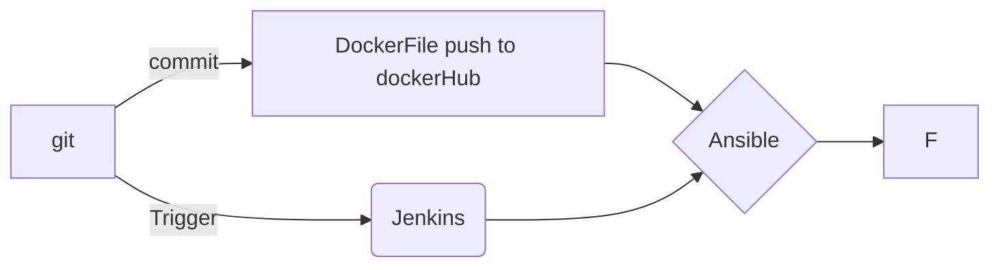

# CI/CD PROJECT

Hi! Here is a ci/cd using **JENKINS**, **Ansible** and **Kubernetes**.
The dev commit with git. Github send a trigger to jenkins trough a webhook( for the need of the build I decide to choose in this case, an automatic trigger every 10 minutes).
n

> **Note:Changes can be done 

# SPEC:

|                |ROLE                         |                         |
|----------------|-------------------------------|-----------------------------|
|ANSIBLE|`'Automation'`            |           |
|KUBERNETES          |`Container Orchestration`            |            |
|JENKINS          |`Continuous Integration and Continuous deployment`|

## diagrams

`

