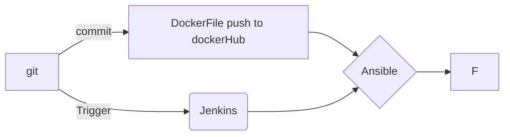

# CI/CD PROJECT (pending)

 

Hi! Here is a ci/cd using **JENKINS**, **Ansible** and **Kubernetes**.
There is three server : WeBapp, Ansible and Jenkins. The dev commit with git command. Github send a trigger to jenkins trough a webhook (for the need of the build I decide to choose in this case, Ngrok to expose my localhost:8080 safetly. Ngrok delivers instant ingress to your apps in any cloud, private network, or devices
with authentication, load balancing, and other critical controls. ).
Then The Dockerfile is commit and past from the Jenkins server to the Ansible server. 

> **Note:Changes can be done 

# SPEC:

|                |ROLE                         |                         |
|----------------|-------------------------------|-----------------------------|
|ANSIBLE|`'Automation'`            |           |
|KUBERNETES          |`Container Orchestration`            |            |
|JENKINS          |`Continuous Integration and Continuous deployment`|

`

